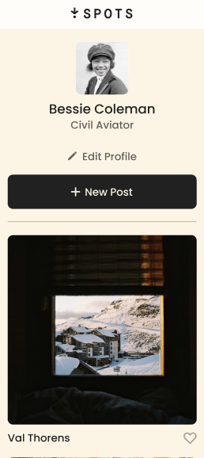
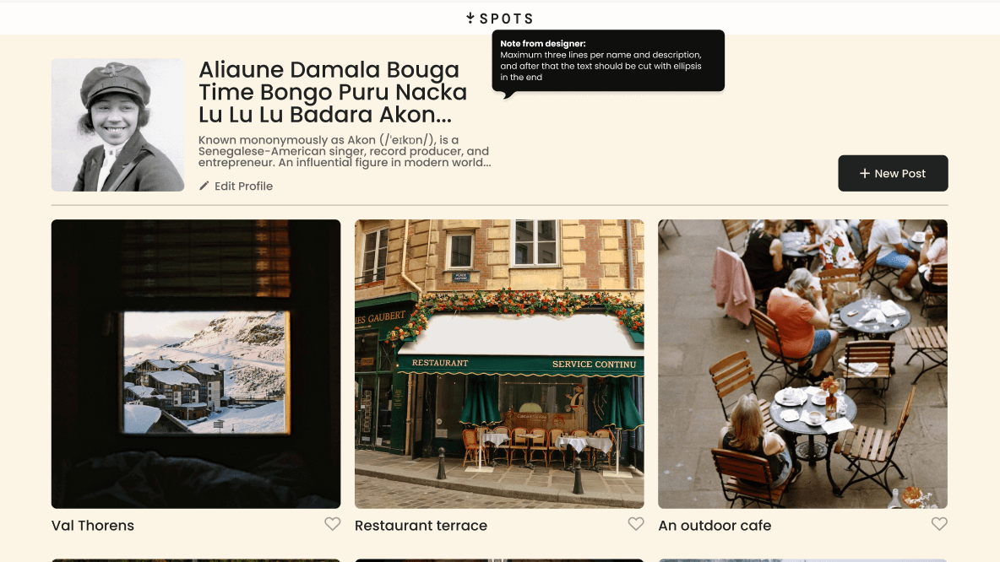
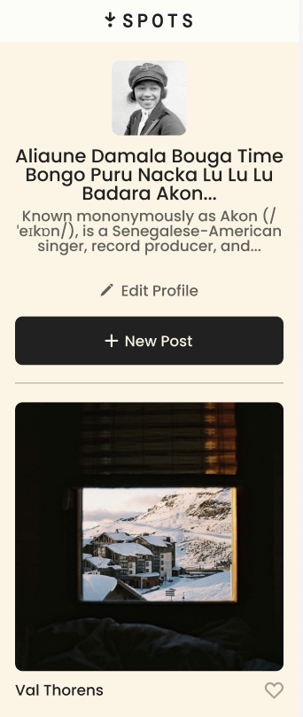

# Project 3: Spots Adapative Web Design

Spots Project from TripleTen's Sprint 3 where I built a social media web app that integrates responsive web design and intermediate HTML/CSS. It is visible on desktop and tablet/mobile view!

## Technologies Used

- Responsive Web Design
- Intermediate HTML & CSS
- Figma Design
- Grid Layouts
- Text overflow
- Media Queries

## Github Pages Webpage Deployment

-[Deployment Link](https://mbernabe04.github.io/se_project_spots/)

## Images/Figma

- [Link to the Figma Design](https://www.figma.com/file/BBNm2bC3lj8QQMHlnqRsga/Sprint-3-Project-%E2%80%94-Spots?type=design&node-id=2%3A60&mode=design&t=afgNFybdorZO6cQo-1)

## Project Pitch Video

Check out [this video](https://drive.google.com/file/d/17yAjNmAkgkF9ywDKEfsqEmMb-9nLNCWH/view?usp=sharing), where I briefly describe my
project and the process of building it!
